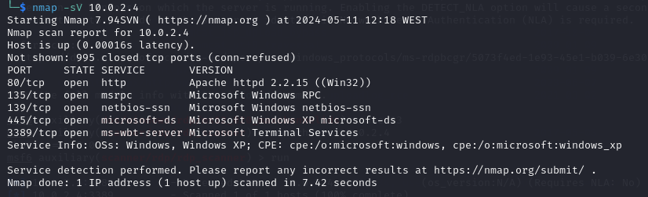

# Denial of Service (Dos)

- This repository was made to show (in an educational way) how you can exploit older versions of Microsoft Windows.

## Preparation and installation guide

For what we intend to do, you will need the following:

+ Virtual Machine (Oracle VM Virtualbox) with Kali Linux, Windows XP and Windows 7 installed;

## Microsoft Terminal Services - Use-After-Free (MS12-020)

This operating system presents a set of critical vulnerabilities that have been discovered and fixed over time. However, they still persist in older versions of Windows, and there is a listing of these issues. 
The first vulnerability used is identified as Microsoft Security Bulletin MS12-020[^MS12], where the version initially used was Windows XP (32-bit), hosted on Oracle VM VirtualBox, with Kali Linux used as the operating system where the necessary operations will be performed. 
The first test intended is to use an exploit that affects Microsoft Terminal Services, specifically a service called Remote Desktop Protocol, which provides a connection to a desktop environment of another computer, meaning it allows remote use of a computer.

[^MS12]: Microsoft Windows. (13 March, 2012). Microsoft Security Bulletin MS12-020 – Critical. https://learn.microsoft.com/en-us/security-updates/SecurityBulletins/2012/ms12-020?redirectedfrom=MSDN

The concept used in this domain is ports. Ports are internet connections controlled by a computer's operating system that are part of the OSI model[^OSI], where each port is associated with a specific process or service and a number. 
This allows differentiation of which services are being used at any given moment. However, to achieve the intended goal, it is necessary to establish a connection with a port on the target machine, but there is no understanding of this process or how it occurs.

[^OSI]: Cloudflare. What is a computer port? https://www.cloudflare.com/learning/network-layer/what-is-a-computer-port/

The OSI model is defined by 7 layers: application, presentation, session, transport, network, datalink, and physical, with ports being located in layer 4 – Transport. When packets are sent to specific services, the protocol from this layer, called TCP, is what directs these packets. 
In total, there are 65535 different ports, with ports 3389 and 80 being used in this project.

In the first phase, access to port 3389 – TCP of the target machine is required, and this port needs to be open. To achieve this, the machine will have to have its Firewall disabled for this purpose. 
However, something crucial is missing: the IP address of the machine, which is a protocol that allows information to travel to the correct destination, with each piece of information being linked to each packet sent. 
In these examples, the IP address is known by definition, but in a real situation, an attacker would need to find a way to obtain this information. 
To verify the port, a software on Kali Linux called Nmap (Network Mapper) is used, which maps networks, identifies active networks, and running services through the machine's IP address. When the mapping is performed, the following results are obtained:

